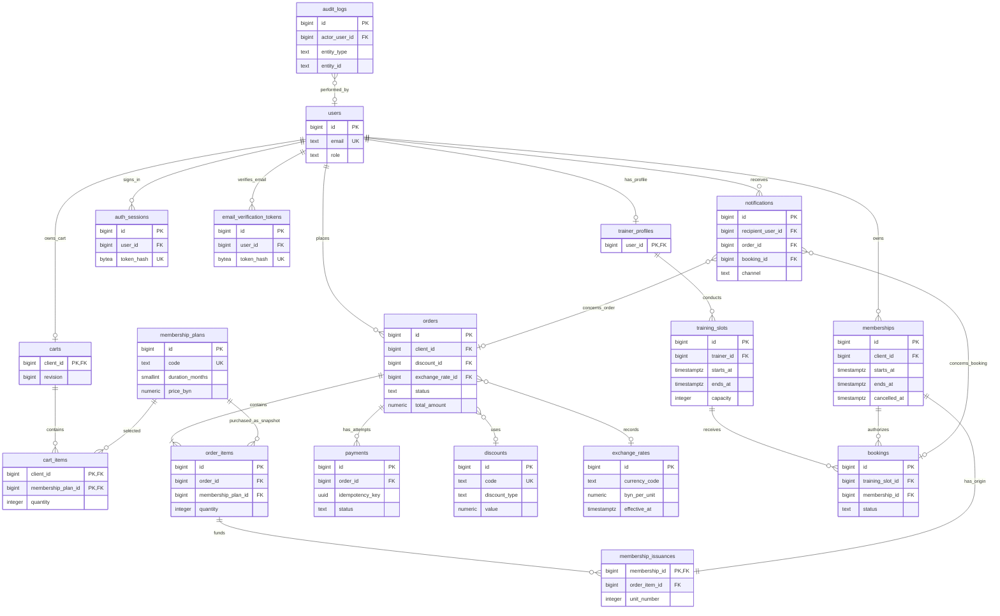

# PostgreSQL Schema Design Details — Version 1

Статус: **проект на согласование, не разрешение на создание миграций**.

Подробная спецификация сохранена из прежнего `schema-proposal.md`. [Краткая версия](schema-proposal.md) содержит обзор; [исходная ER-диаграмма Crow's Foot](../diagrams/er-diagram.png) и [редактируемый источник](../diagrams/er-diagram.drawio) показывают те же 18 сущностей. Уточнение от 30.09.2026: клиент не может иметь пересекающиеся активные бронирования (`pending`/`approved`); эта проверка добавлена в существующий транзакционный протокол без новых таблиц или колонок. По последующему запросу пользователя создан отдельный [файл в нотации Питера Чена](../diagrams/diagram_chen.drawio): 18 сущностей, все 29 связей и атрибуты соединены на одном листе, без изменения схемы базы данных. Обозначения и экспорты описаны в [указателе диаграмм](../diagrams/README.md#peter-chen-diagram).

Основание: корневые `README.md`, `AGENTS.md` и утверждённые пользователем бизнес-правила первой версии. Стек остаётся прежним: PostgreSQL, asyncpg, Alembic с ручным SQL, FastAPI/Pydantic, React/TypeScript/Vite; модульный монолит. Этот документ описывает модель, но не создаёт БД, SQL-миграции или код приложения.

## 1. Решения, которые необходимо согласовать вместе со схемой

Критического технического противоречия нет. Следующие уточнения закрывают оставшиеся неоднозначности; это **предложения**, а не уже утверждённые пользователем требования.

| ID | Предлагаемое решение | Причина и альтернатива |
|---|---|---|
| D1 | Один заказ может содержать несколько тарифов и несколько единиц каждого тарифа. Все периоды принадлежат покупателю и следуют последовательно в порядке `line_number`, затем `unit_number`. | Сохраняет полноценную корзину и запрет пересечения абонементов. Альтернатива — ограничить заказ одним абонементом. Дарение и назначение другому клиенту не предусмотрены. |
| D2 | `pending` у абонемента означает оплаченный будущий период. До успешной оплаты существует только заказ. Статус абонемента вычисляется представлением по датам и признаку отмены. | Согласует создание абонемента после оплаты с состоянием `pending`. Альтернатива — хранить статус и отдельно синхронизировать его при наступлении дат; это создаёт риск устаревших значений. |
| D3 | Сроки — 1, 3 и 12 календарных месяцев в `Europe/Minsk`. Интервалы полуоткрытые: `[starts_at, ends_at)`. Для записи один абонемент должен покрывать всю тренировку. | Месяц не равен 30 дням. При отсутствии исходного числа в целевом месяце используется последний день месяца. Каждая следующая единица продления рассчитывается от конца предыдущей. Альтернатива для допуска — проверять только момент начала занятия. |
| D4 | Создание и подтверждение заявки разрешены только до начала слота. После его начала необработанная заявка сразу требует внимания, даже если 12 часов ещё не истекли. | Убирает возможность подтверждения уже начавшегося занятия. Более мягкая альтернатива — разрешать подтверждение до окончания, но она не рекомендуется. |
| D5 | Цена и демонстрационная оплата всегда в BYN; USD/EUR используются для отображения. Фиксированная скидка задаётся в BYN. Валюта отображения, курс и отображённые суммы сохраняются в заказе. | Следует формулировке «дополнительно поддерживать отображение». Альтернатива — имитировать оплату в выбранной валюте; тогда правила суммы платежа нужно изменить до миграций. |
| D6 | Формализованные различия тарифов в v1: цена, срок, доступ к индивидуальным и/или групповым тренировкам. Названия и пояснения доступны на RU/EN. | Количество посещений не учитывается. Ограничения по времени суток, дням недели, залам и конкретным тренерам не добавляются. Если нужны такие условия, модель необходимо дополнить. |
| D7 | При отмене абонемента администратором его ещё не начавшиеся заявки `pending`/`approved` отменяются в той же транзакции. Остальные оплаченные периоды не сдвигаются. Денежного возврата нет. | Не оставляет будущие бронирования без действующего основания. Уже состоявшиеся посещения и финансовая история сохраняются. |
| D8 | Для входа использовать непрозрачные серверные сессии с хранением только хеша токена; добавить `auth_sessions`. | Простой вариант отзыва сессий для одного backend. JWT не задан исходным ТЗ; при выборе другой схемы потребуется пересмотреть только вспомогательную модель авторизации. |
| D9 | Включить поставляемое с PostgreSQL расширение `btree_gist` для ограничений пересечения периодов. | Это расширение выбранной СУБД, отдельного сервиса не требуется. Альтернатива при запрете расширения — проверка пересечений под блокировками; она слабее как декларативная защита данных. |
| D10 | В v1 импортировать тарифы, курсы и профили уже существующих тренеров; экспортировать разрешённые бизнес-данные. Все три формата обязательны для выбранных наборов. | Импорт финансовых операций, паролей, сессий и сырых строк бронирований не нужен для демонстрации обмена данными и может обходить бизнес-процессы. Расширение перечня импортируемых сущностей согласуется отдельно. |

Дополнительно предлагается сохранять условия заказа при оформлении: изменение тарифа, промокода или курса впоследствии не пересчитывает уже созданный заказ. Срок автоматического истечения неоплаченного заказа не вводится; администратор или владелец может отменить его до оплаты. Архивирование тарифа закрывает новые покупки, но не аннулирует уже оформленные заказы.

Диаграммы предыдущей курсовой доступны в `docs/diagrams/old/`. Существующая Use Case принята без изменений; новая блок-схема использует `activity-diagram.png` как основу и уточняет резервирование, пересечения, проблемные заявки и уведомления. Старые мобильные приложения, банковская интеграция и отдельная сущность проблемной заявки не переносятся в текущую архитектуру. Требования текущего README и согласованные уточнения имеют приоритет.

## 2. Общие соглашения

- Основной идентификатор — `BIGINT GENERATED ALWAYS AS IDENTITY`. Исключения с естественным или составным PK обозначены отдельно.
- В таблицах ниже поля обязательны (`NOT NULL`), если не указано `NULL`. PK всегда обязателен.
- Все моменты времени — `TIMESTAMPTZ`; даты отображаются в `Europe/Minsk`. Конечные даты и суммы должны быть конечными значениями, без `infinity`/`NaN`.
- Денежные суммы — `NUMERIC(14,2)`, курс BYN за одну единицу валюты — `NUMERIC(18,8)`. Расчёты выполняются десятичной арифметикой, без `float`.
- Роли, состояния, валюты и каналы — `TEXT` с явно указанными `CHECK`, без отдельных таблиц для нескольких фиксированных значений.
- `created_at` заполняется БД при создании. `updated_at`, где он есть, меняется при обновлении. Бизнес-время решения фиксируется отдельно после получения блокировок.
- `JSONB` применяется только к данным шаблона уведомления и деталям аудита. Связи, права доступа, деньги и условия тарифов остаются обычными колонками.
- По умолчанию FK имеют `ON DELETE RESTRICT`, идентификаторы неизменяемы. Исторические сущности не удаляются каскадно. Удаление строки корзины, истёкшей сессии или токена допустимо отдельно.
- Пользователи деактивируются, тарифы и промокоды архивируются через `is_active`. Заказы, платежи, выданные абонементы и посещения физически не удаляются.
- Регистронезависимые ключи нормализуются: email — `trim` и нижний регистр; коды тарифов и промокоды — верхний регистр. БД проверяет каноническую форму и уникальность.

## 3. Перечень таблиц

| № | Таблица | Назначение | Модуль |
|---|---|---|---|
| 1 | `users` | Учётные записи трёх ролей | `users`, `auth` |
| 2 | `trainer_profiles` | Публичные сведения о тренерах | `trainers` |
| 3 | `auth_sessions` | Отзываемые сессии входа | `auth` |
| 4 | `email_verification_tokens` | Одноразовое подтверждение email | `auth` |
| 5 | `membership_plans` | Каталог абонементов | `memberships` |
| 6 | `carts` | Одна текущая корзина клиента и её версия | `cart` |
| 7 | `cart_items` | Выбранные тарифы и количества | `cart` |
| 8 | `discounts` | Процентные и фиксированные промокоды | `orders` |
| 9 | `exchange_rates` | История вручную заданных курсов | `orders` |
| 10 | `orders` | Заказы и финансовые итоги | `orders` |
| 11 | `order_items` | Исторические условия купленных тарифов | `orders` |
| 12 | `payments` | Завершённые попытки демонстрационной оплаты | `payments` |
| 13 | `memberships` | Выданные клиентам периоды доступа | `memberships` |
| 14 | `membership_issuances` | Связь каждой единицы покупки с выданным абонементом | `memberships` |
| 15 | `training_slots` | Индивидуальные и групповые занятия | `schedule` |
| 16 | `bookings` | Заявки, решения и посещения | `bookings` |
| 17 | `notifications` | Уведомления в интерфейсе и очередь email | `notifications` |
| 18 | `audit_logs` | Аудит значимых действий | `core`, все модули |

`reports` получает данные запросами и представлениями; отдельная таблица готовых файлов не нужна. Сущности дополнительных услуг, возвратов, посещений по лимиту и отдельные роли гостя не создаются.

## 4. Атрибуты, ключи и ограничения

### 4.1. `users`

| Атрибут | Тип и назначение |
|---|---|
| `id` | `BIGINT`, PK |
| `email` | `TEXT`, UNIQUE, нормализованный email |
| `password_hash` | `TEXT`, хеш Argon2; исходный пароль не хранится |
| `role` | `TEXT`, `CLIENT`, `TRAINER` или `ADMIN` |
| `first_name`, `last_name` | `TEXT`, непустые имена |
| `phone` | `TEXT NULL`, не уникален |
| `locale` | `TEXT`, `ru` или `en`, default `ru` |
| `is_active` | `BOOLEAN`, default `true` |
| `email_verified_at` | `TIMESTAMPTZ NULL` |
| `created_at`, `updated_at` | `TIMESTAMPTZ` |

Одна запись имеет одну неизменяемую роль. Саморегистрация всегда создаёт `CLIENT`; тренера создаёт администратор, первого администратора — отдельная команда. Изменение роли существующего пользователя не вводится в v1. Блокировка пользователя отзывает его сессии; существующие оплаченные данные сохраняются. Предлагается разрешать покупки и новые записи только после подтверждения email.

### 4.2. `trainer_profiles`

| Атрибут | Тип и назначение |
|---|---|
| `user_id` | `BIGINT`, одновременно PK и FK → `users.id` |
| `specialization_ru`, `specialization_en` | `TEXT` |
| `bio_ru`, `bio_en` | `TEXT`, default пустая строка |
| `created_at`, `updated_at` | `TIMESTAMPTZ` |

Профиль допустим только для `TRAINER`. Аккаунт тренера и профиль создаются вместе; проверка роли и полноты пары выполняется отложенной проверкой целостности. Имя и email не дублируются.

### 4.3. `auth_sessions`

| Атрибут | Тип и назначение |
|---|---|
| `id` | `BIGINT`, PK |
| `user_id` | `BIGINT`, FK → `users.id` |
| `token_hash` | `BYTEA`, UNIQUE, 32 байта для SHA-256 хеша случайного токена |
| `created_at`, `expires_at` | `TIMESTAMPTZ` |
| `revoked_at` | `TIMESTAMPTZ NULL` |

`expires_at > created_at`; отзыв не раньше создания. Проверка срока и активности пользователя выполняется при каждом обращении. В браузер передаётся исходный случайный токен в защищённой HttpOnly-cookie; параметры SameSite и защита от CSRF определяются при реализации HTTP-доступа. Исходный токен в БД и логах не сохраняется.

### 4.4. `email_verification_tokens`

| Атрибут | Тип и назначение |
|---|---|
| `id` | `BIGINT`, PK |
| `user_id` | `BIGINT`, FK → `users.id` |
| `token_hash` | `BYTEA`, UNIQUE, 32 байта |
| `created_at`, `expires_at` | `TIMESTAMPTZ` |
| `used_at`, `revoked_at` | `TIMESTAMPTZ NULL` |

`expires_at > created_at`; `used_at` и `revoked_at` не могут быть заполнены одновременно и не предшествуют созданию. Частичная уникальность по `user_id` для ещё не использованного и не отозванного токена. При перевыпуске старый такой токен отзывается, даже если уже истёк. Проверка истечения делается по времени, а не предикатом уникального индекса.

### 4.5. `membership_plans`

| Атрибут | Тип и назначение |
|---|---|
| `id` | `BIGINT`, PK |
| `code` | `TEXT`, UNIQUE, стабильный код |
| `name_ru`, `name_en` | `TEXT`, непустые названия |
| `description_ru`, `description_en` | `TEXT`, пояснение условий |
| `duration_months` | `SMALLINT`, одно из `1`, `3`, `12` |
| `price_byn` | `NUMERIC(14,2)`, больше нуля |
| `allows_individual`, `allows_group` | `BOOLEAN`, согласно D6 |
| `is_active` | `BOOLEAN`, default `true` |
| `created_at`, `updated_at` | `TIMESTAMPTZ` |

Хотя бы один тип занятия разрешён. Полей количества или остатка посещений нет. Изменения тарифа влияют только на будущие заказы; купленные условия берутся из `order_items`.

### 4.6. `carts`

| Атрибут | Тип и назначение |
|---|---|
| `client_id` | `BIGINT`, PK и FK → `users.id` |
| `revision` | `BIGINT`, неотрицательная версия, default `0` |
| `created_at`, `updated_at` | `TIMESTAMPTZ` |

Одна постоянная корзина на клиента; создаётся при первом обращении. Владелец имеет роль `CLIENT`. Каждое изменение состава или порядка, включая очистку после оформления, увеличивает `revision`. Итоги и цены в корзине не хранятся.

### 4.7. `cart_items`

| Атрибут | Тип и назначение |
|---|---|
| `client_id` | `BIGINT`, FK → `carts.client_id`, часть PK |
| `membership_plan_id` | `BIGINT`, FK → `membership_plans.id`, часть PK |
| `quantity` | `INTEGER`, больше нуля |
| `position` | `INTEGER`, больше нуля; порядок будущих периодов |
| `created_at`, `updated_at` | `TIMESTAMPTZ` |

PK: `(client_id, membership_plan_id)`. UNIQUE: `(client_id, position)`, с возможностью отложенной проверки при перестановке строк внутри транзакции. Один тариф занимает одну строку с количеством; повторное добавление увеличивает количество.

### 4.8. `discounts`

| Атрибут | Тип и назначение |
|---|---|
| `id` | `BIGINT`, PK |
| `code` | `TEXT`, UNIQUE, нормализованный промокод |
| `discount_type` | `TEXT`, `percentage` или `fixed` |
| `value` | `NUMERIC(14,2)`, процент либо сумма BYN |
| `valid_from`, `valid_until` | `TIMESTAMPTZ` |
| `is_active` | `BOOLEAN`, default `true` |
| `created_at`, `updated_at` | `TIMESTAMPTZ` |

`valid_until > valid_from`; `value > 0`, а для `percentage` также `value <= 100`. В заказе только один FK на промокод. Лимиты использований, комбинации кодов и персональные условия не вводятся. Применимость проверяется на момент оформления заказа.

### 4.9. `exchange_rates`

| Атрибут | Тип и назначение |
|---|---|
| `id` | `BIGINT`, PK |
| `currency_code` | `TEXT`, `USD` или `EUR` |
| `byn_per_unit` | `NUMERIC(18,8)`, строго больше нуля |
| `effective_at` | `TIMESTAMPTZ`, начало применимости версии |
| `created_by_user_id` | `BIGINT`, FK → `users.id`, администратор |
| `created_at` | `TIMESTAMPTZ` |

UNIQUE: `(currency_code, effective_at)`. Для BYN курс равен 1, отдельная строка не нужна. Выбирается последняя запись с `effective_at <= decision_time`. Курсы добавляются новыми версиями, использованные строки не редактируются и не удаляются. Отсутствующий курс блокирует оформление с выбранной иностранной валютой отображения, но не с BYN.

### 4.10. `orders`

| Атрибут | Тип и назначение |
|---|---|
| `id` | `BIGINT`, PK |
| `client_id` | `BIGINT`, FK → `users.id`, покупатель `CLIENT` |
| `status` | `TEXT`: `awaiting_payment`, `paid`, `cancelled` |
| `source_cart_revision` | `BIGINT`, неотрицательная версия оформленной корзины |
| `idempotency_key` | `UUID`, ключ запроса оформления |
| `request_hash` | `BYTEA`, 32 байта, отпечаток значимых параметров запроса |
| `currency_code` | `TEXT`, только `BYN` |
| `subtotal_amount`, `discount_amount`, `total_amount` | `NUMERIC(14,2)`, исторические суммы BYN |
| `discount_id` | `BIGINT NULL`, FK → `discounts.id` |
| `promo_code_snapshot`, `discount_type_snapshot` | `TEXT NULL` |
| `discount_value_snapshot` | `NUMERIC(14,2) NULL` |
| `display_currency_code` | `TEXT`: `BYN`, `USD`, `EUR` |
| `exchange_rate_id` | `BIGINT NULL`, FK → `exchange_rates.id` |
| `exchange_rate_snapshot` | `NUMERIC(18,8)`, BYN за единицу валюты отображения |
| `display_subtotal_amount`, `display_discount_amount`, `display_total_amount` | `NUMERIC(14,2)`, сохранённые суммы отображения |
| `created_at` | `TIMESTAMPTZ` |
| `paid_at`, `cancelled_at` | `TIMESTAMPTZ NULL` |
| `cancelled_by_user_id` | `BIGINT NULL`, FK → `users.id` |
| `cancellation_reason` | `TEXT NULL` |

UNIQUE: `(client_id, idempotency_key)` и `(client_id, source_cart_revision)`. Повтор ключа с другим `request_hash` отклоняется.

CHECK: все суммы неотрицательны; `discount_amount <= subtotal_amount`; `total_amount = subtotal_amount - discount_amount`; аналогичное равенство для сумм отображения. Без промокода все поля его снимка пусты и скидка равна нулю; при наличии заполнены FK и весь снимок с корректным типом/значением.

Для BYN: `exchange_rate_id IS NULL`, курс 1, суммы отображения равны базовым. Для USD/EUR: FK обязателен, курс положителен; соответствие валюты записи курса проверяется межтаблично. `paid_at` заполнено только у `paid`; поля отмены — только у `cancelled`; временные отметки не раньше создания. Оплаченный заказ не переводится в `cancelled`, поскольку возвратов нет.

В момент commit каждый заказ содержит хотя бы одну строку. Суммы заказа равны суммам строк. Финансовые поля и строки после оформления неизменяемы; разрешены только переход состояния и соответствующие отметки.

### 4.11. `order_items`

| Атрибут | Тип и назначение |
|---|---|
| `id` | `BIGINT`, PK |
| `order_id` | `BIGINT`, FK → `orders.id` |
| `line_number` | `INTEGER`, больше нуля, порядок выдачи периодов |
| `membership_plan_id` | `BIGINT`, FK → `membership_plans.id` |
| `quantity` | `INTEGER`, больше нуля |
| `plan_code_snapshot` | `TEXT` |
| `plan_name_ru_snapshot`, `plan_name_en_snapshot` | `TEXT` |
| `duration_months_snapshot` | `SMALLINT`, `1`, `3` или `12` |
| `allows_individual_snapshot`, `allows_group_snapshot` | `BOOLEAN` |
| `unit_price_amount` | `NUMERIC(14,2)`, больше нуля, BYN |
| `subtotal_amount`, `discount_amount`, `total_amount` | `NUMERIC(14,2)`, суммы строки BYN |

UNIQUE: `(order_id, line_number)`. CHECK: `subtotal_amount = unit_price_amount * quantity`, `0 <= discount_amount <= subtotal_amount`, `total_amount = subtotal_amount - discount_amount`; хотя бы один вид тренировок разрешён. FK на тариф нужен для аналитики, но исторические условия берутся из снимков, а не из текущего каталога.

Скидка заказа распределяется по строкам пропорционально их исходной сумме в целых копейках. Остаток округления распределяется по наибольшим дробным остаткам, при равенстве — по `line_number`. Так сумма скидок строк точно равна скидке заказа, а аналитика выручки по тарифам не завышает продажи.

### 4.12. `payments`

| Атрибут | Тип и назначение |
|---|---|
| `id` | `BIGINT`, PK |
| `order_id` | `BIGINT`, FK → `orders.id` |
| `idempotency_key` | `UUID`, ключ конкретной попытки оплаты |
| `request_hash` | `BYTEA`, 32 байта |
| `status` | `TEXT`, `succeeded` или `failed` |
| `amount` | `NUMERIC(14,2)`, неотрицательная сумма |
| `currency_code` | `TEXT`, только `BYN` |
| `failure_code` | `TEXT NULL`, обезличенная причина неуспеха |
| `created_at`, `processed_at` | `TIMESTAMPTZ` |

UNIQUE: `(order_id, idempotency_key)`. Частичный UNIQUE по `order_id` при `status = 'succeeded'`: у заказа не более одного успешного платежа. `processed_at >= created_at`; причина обязательна для `failed` и отсутствует для `succeeded`. Сумма и валюта равны замороженному итогу заказа; это межтабличная проверка.

Для синхронной демонстрации сохраняются только завершённые попытки. Неуспех сохраняется и оставляет заказ в `awaiting_payment`; новая попытка получает новый ключ. Платежи после создания неизменяемы. При 100% скидке допустим успешный демонстрационный платёж на 0 BYN.

### 4.13. `memberships`

| Атрибут | Тип и назначение |
|---|---|
| `id` | `BIGINT`, PK |
| `client_id` | `BIGINT`, FK → `users.id`, владелец `CLIENT` |
| `starts_at`, `ends_at` | `TIMESTAMPTZ`, выданный период |
| `created_at` | `TIMESTAMPTZ` |
| `cancelled_at` | `TIMESTAMPTZ NULL` |
| `cancelled_by_user_id` | `BIGINT NULL`, FK → `users.id`, администратор |
| `cancellation_reason` | `TEXT NULL` |

CHECK: `ends_at > starts_at`, `starts_at >= created_at`; поля отмены либо все отсутствуют, либо все заполнены, отмена не раньше создания. Владелец и границы выданного периода неизменяемы.

Ограничение исключения GiST запрещает пересечение `tstzrange(starts_at, ends_at, '[)')` у одного `client_id` среди строк без отмены. Оно защищает также будущие периоды. Отменённый период сохраняется для истории и не блокирует новую выдачу.

Физического столбца `status` нет. Представление `v_membership_status` возвращает ровно требуемые значения:

- `cancelled`, если есть `cancelled_at`;
- `pending`, если текущее время раньше `starts_at`;
- `active`, если `starts_at <= текущее время < ends_at`;
- `expired`, если текущее время не раньше `ends_at`.

Для допуска на будущую тренировку нельзя требовать текущий статус `active`: оплаченный `pending` тоже подходит, если его период покрывает слот и абонемент не отменён. Условия доступа и тариф определяются через `membership_issuances` → `order_items`.

### 4.14. `membership_issuances`

| Атрибут | Тип и назначение |
|---|---|
| `membership_id` | `BIGINT`, PK и FK → `memberships.id` |
| `order_item_id` | `BIGINT`, FK → `order_items.id` |
| `unit_number` | `INTEGER`, больше нуля, номер единицы внутри строки |

UNIQUE: `(order_item_id, unit_number)`. Отложенные проверки при commit обеспечивают:

- каждый абонемент связан ровно с одной единицей покупки;
- `unit_number <= order_items.quantity`;
- заказ источника оплачен; владелец абонемента совпадает с покупателем;
- для каждой строки оплаченного заказа существуют ровно `quantity` выдач с номерами `1..quantity`;
- у неоплаченного или отменённого заказа выдач нет.

Эта небольшая таблица сохраняет 3НФ: в `memberships` не приходится дублировать `order_item_id`, который однозначно определял бы покупателя через заказ. Повторная обработка оплаты не может создать ещё одну выдачу той же единицы.

### 4.15. `training_slots`

| Атрибут | Тип и назначение |
|---|---|
| `id` | `BIGINT`, PK |
| `trainer_id` | `BIGINT`, FK → `trainer_profiles.user_id` |
| `training_kind` | `TEXT`, `individual` или `group` |
| `title_ru`, `title_en` | `TEXT`, непустые названия |
| `starts_at`, `ends_at` | `TIMESTAMPTZ` |
| `capacity` | `INTEGER`, больше нуля |
| `status` | `TEXT`, `scheduled`, `completed`, `cancelled` |
| `created_at`, `updated_at` | `TIMESTAMPTZ` |
| `completed_at`, `cancelled_at` | `TIMESTAMPTZ NULL` |
| `cancelled_by_user_id` | `BIGINT NULL`, FK → `users.id` |
| `cancellation_reason` | `TEXT NULL` |

CHECK: `ends_at > starts_at`; для `individual` вместимость строго 1. Для группы допускается любая положительная вместимость. Поля завершения/отмены согласованы со статусом; завершение не раньше `ends_at`.

GiST-ограничение исключения запрещает пересечения временных интервалов одного тренера среди неотменённых слотов. Граничные слоты, например 10:00–11:00 и 11:00–12:00, совместимы. Завершённые занятия продолжают участвовать в проверке исторической корректности.

Свободные места вычисляются, отдельного изменяемого счётчика нет. После появления хотя бы одной заявки предлагается запретить изменение тренера, типа, начала и конца слота: для переноса создаётся новый слот, старый отменяется с уведомлениями. Вместимость до начала можно менять под блокировкой, но нельзя уменьшать ниже числа `pending`/`approved`. Клиент не может иметь пересекающиеся активные заявки (`pending`/`approved`) на разные слоты, включая слоты разных тренеров. Проверка охватывает все его абонементы. Полуоткрытые интервалы `[starts_at, ends_at)` допускают занятия подряд с общей границей.

### 4.16. `bookings`

| Атрибут | Тип и назначение |
|---|---|
| `id` | `BIGINT`, PK |
| `training_slot_id` | `BIGINT`, FK → `training_slots.id` |
| `membership_id` | `BIGINT`, FK → `memberships.id` |
| `status` | `TEXT`: `pending`, `approved`, `rejected`, `cancelled`, `attended`, `no_show` |
| `created_at`, `updated_at` | `TIMESTAMPTZ` |
| `reviewed_at` | `TIMESTAMPTZ NULL` |
| `reviewed_by_user_id` | `BIGINT NULL`, FK → `users.id` |
| `review_reason` | `TEXT NULL` |
| `cancelled_at` | `TIMESTAMPTZ NULL` |
| `cancelled_by_user_id` | `BIGINT NULL`, FK → `users.id` |
| `cancellation_reason` | `TEXT NULL` |
| `attendance_marked_at` | `TIMESTAMPTZ NULL` |
| `attendance_marked_by_user_id` | `BIGINT NULL`, FK → `users.id` |

Клиент определяется по `memberships.client_id`, отдельного дублирующего `client_id` нет. Тренер определяется через слот.

Частичный UNIQUE: `(training_slot_id, membership_id)` для `pending`, `approved`, `attended`, `no_show`. После отказа/отмены допускается новая заявка с новой строкой, если слот ещё доступен. Дополнительная проверка в транзакции ищет занятую запись того же клиента на слот через все его абонементы; частичный индекс сам по себе эту межтабличную проверку не заменяет.

`pending` и `approved` занимают по одному месту. Переход `pending → approved` не занимает второе место. `rejected` и `cancelled` освобождают резерв.

Для двух активных заявок одного клиента пересечение существует, если `existing.starts_at < candidate.ends_at` и `candidate.starts_at < existing.ends_at`. Клиент определяется через `memberships`, время — через `training_slots`. Проверка выполняется после блокировки строки клиента и повторяется при подтверждении с исключением самой проверяемой заявки. UNIQUE для одного слота не заменяет эту проверку. Обычный EXCLUDE по `bookings` не применяется: времени и `client_id` в этой таблице нет; новые колонки не добавляются.

CHECK согласует парные поля времени/исполнителя. Для `pending` нет решения, отмены или отметки посещения; для `approved`/`rejected` есть решение; для `attended`/`no_show` сохраняется решение и появляется отметка посещения. При отмене сохраняется предыдущее решение, если оно было. Причина отказа/отмены обязательна; временные отметки не раньше создания. Право исполнителя, допустимость перехода и сравнение со временем слота проверяются бизнес-операцией.

Разрешённые переходы: `pending → approved/rejected/cancelled`, `approved → cancelled/attended/no_show`. Остальные состояния терминальные для v1. Посещение или неявку тренер отмечает только после окончания занятия. Завершение слота возможно после окончания, когда все его заявки приведены в терминальные состояния. Неподтверждённую заявку после начала нельзя помечать как посещение.

### 4.17. `notifications`

| Атрибут | Тип и назначение |
|---|---|
| `id` | `BIGINT`, PK |
| `recipient_user_id` | `BIGINT`, FK → `users.id` |
| `event_key` | `TEXT`, стабильный ключ события, например `booking:123:approved` |
| `channel` | `TEXT`, `in_app` или `email` |
| `template_key` | `TEXT`, ключ локализованного шаблона |
| `locale` | `TEXT`, `ru` или `en`, язык сообщения |
| `payload` | `JSONB`, объект параметров шаблона, default `{}` |
| `order_id` | `BIGINT NULL`, FK → `orders.id` |
| `booking_id` | `BIGINT NULL`, FK → `bookings.id` |
| `email_to` | `TEXT NULL`, адрес доставки email на момент события |
| `delivery_status` | `TEXT NULL`, `pending`, `sent`, `failed` только для email |
| `attempt_count` | `INTEGER`, неотрицательное число, default `0` |
| `created_at` | `TIMESTAMPTZ` |
| `last_attempt_at`, `sent_at`, `read_at` | `TIMESTAMPTZ NULL` |
| `last_error` | `TEXT NULL`, безопасное описание сбоя |

UNIQUE: `(event_key, recipient_user_id, channel)`. Для `in_app` нет email-полей доставки, `read_at` допустим; для `email` обязательны адрес и состояние доставки, `read_at` отсутствует. `sent_at` заполнено только для `sent`. `order_id` и `booking_id` не заполняются одновременно. Роль получателя и принадлежность связанного объекта проверяет операция создания события.

Строки уведомлений создаются в той же транзакции, что и бизнес-событие. Отправка email происходит после commit; сбой доставки не откатывает оплату или решение тренера. Эта таблица позволяет повторить доставку без отдельного брокера. Она не обещает ровно одну фактическую доставку внешним email-провайдером.

Исходные токены подтверждения, пароли и токены сессий запрещены в `payload`, аудитах и ошибках. При повторной отправке подтверждения можно выпустить новый одноразовый токен и отозвать прежний; секрет передаётся отправителю только в памяти после успешной транзакции.

### 4.18. `audit_logs`

| Атрибут | Тип и назначение |
|---|---|
| `id` | `BIGINT`, PK |
| `actor_user_id` | `BIGINT NULL`, FK → `users.id`; NULL для системного действия |
| `action` | `TEXT`, стабильное имя действия |
| `entity_type` | `TEXT`, тип затронутого объекта |
| `entity_id` | `TEXT NULL`, идентификатор, включая составные ключи |
| `details` | `JSONB`, объект разрешённых деталей, default `{}` |
| `request_id` | `UUID NULL`, идентификатор запроса |
| `occurred_at` | `TIMESTAMPTZ` |

Таблица только дополняется. `entity_type/entity_id` — намеренно историческая ссылка без универсального FK: аудит может описывать удаление строки корзины или отказ в действии. Пароли, их хеши, токены и полные секретные запросы не логируются. Изменения ролей через аудит не реализуются; роль неизменяема согласно принятой модели.

## 5. Связи и кардинальности

| Связь | Кардинальность и смысл |
|---|---|
| `users` → `trainer_profiles` | 1 : 0..1; для роли TRAINER ровно один профиль |
| `users` → `auth_sessions`, `email_verification_tokens` | 1 : 0..N |
| `users` → `carts` | 1 : 0..1; только CLIENT |
| `carts` → `cart_items` | 1 : 0..N |
| `membership_plans` → `cart_items`, `order_items` | 1 : 0..N |
| `users` → `orders`, `memberships` | 1 : 0..N; только CLIENT |
| `orders` → `order_items` | 1 : 1..N к моменту commit |
| `orders` → `payments` | 1 : 0..N попыток, максимум одна успешная |
| `discounts` → `orders` | 1 : 0..N; у заказа 0..1 промокод |
| `exchange_rates` → `orders` | 1 : 0..N; у заказа 0..1 версия курса |
| `order_items` → `membership_issuances` | 1 : 0..N; для оплаченной строки ровно `quantity` |
| `memberships` → `membership_issuances` | 1 : 1 к моменту commit |
| `trainer_profiles` → `training_slots` | 1 : 0..N |
| `training_slots` → `bookings` | 1 : 0..N исторических заявок; текущий резерв ограничен `capacity` |
| `memberships` → `bookings` | 1 : 0..N |
| `users` → `notifications` | 1 : 0..N по получателю |
| `orders`, `bookings` → `notifications` | Каждая сущность 1 : 0..N; ссылка в уведомлении необязательна |
| `users` → записи с исполнителем | 1 : 0..N для создания курса, решения, отмены, отметки посещения, аудита |

## 6. ER-диаграмма

Диаграмма показывает все таблицы и основные связи. Служебные FK исполнителей подробно перечислены в словаре выше и опущены на диаграмме для читаемости. Полная обязательность некоторых связей обеспечивается отложенными проверками, а не одним FK.

## 7. Как обеспечивается целостность

### 7.1. Декларативные ограничения

PK/FK, `NOT NULL`, положительные количества, допустимые состояния, согласованность полей одной строки и денежные равенства задаются обычными ограничениями. Пересечения периодов — двумя GiST-ограничениями исключения, повторный успешный платёж и повторная занятая запись — частичными уникальными индексами.

PostgreSQL не предназначает `CHECK` для проверки других строк или таблиц. Поэтому количество занятых мест, суммы строк заказа, роль владельца и факт выдачи всех единиц покупки нельзя объявить обычным `CHECK`. [Документация PostgreSQL: ограничения](https://www.postgresql.org/docs/current/ddl-constraints.html).

Диапазоны позволяют выразить непересечение интервалов; `btree_gist` добавляет сравнение числового владельца/тренера в то же GiST-ограничение. [Диапазоны](https://www.postgresql.org/docs/current/rangetypes.html), [btree_gist](https://www.postgresql.org/docs/current/btree-gist.html).

### 7.2. Обоснованные функции и триггеры

При последующей реализации предлагаются небольшие адресные проверки, без переноса всех сервисов в хранимые процедуры:

1. **Роли и профиль:** неизменность `users.role`; принадлежность владельцев корзины/заказа/абонемента к CLIENT, профиля к TRAINER, автора курса к ADMIN; наличие профиля у тренера к commit.
2. **Согласованность покупки при commit:** непустой заказ, суммы строк и скидки, соответствие платежа итогу, ровно один успешный платёж у `paid`, отсутствие успешного платежа у других статусов.
3. **Полнота выдачи при commit:** соответствие `membership_issuances` оплаченным количествам, покупателю и существующим абонементам, отсутствие выдач неоплаченных заказов.
4. **Неизменяемая история:** запрет переписывания финансовых снимков после создания заказа, редактирования/удаления попыток оплаты и выдач, удаления финансовой истории, изменения владельца/дат выданного абонемента. Вставка новых строк в уже существующий заказ также запрещена; новые строки допустимы только при его первоначальном создании в одной транзакции.
5. **Жизненный цикл:** запрет неразрешённых переходов состояний; аудит дополняется без UPDATE/DELETE. Права DB-роли приложения также ограничивают разрушительные операции.

Проверки итогов и выдач — отложенные constraint triggers на всех затрагивающих эти инварианты таблицах. Они видят завершённое состояние транзакции. Временная неполнота между вставкой заказа, строк, оплаты и выдач допустима внутри транзакции, но не после commit.

### 7.3. Проверки, выполняемые транзакционным сервисом

Вместимость, действительность абонемента для слота, отсутствие повторной или пересекающейся активной заявки клиента через любой его абонемент, права исполнителя и временные границы проверяются SQL-запросами под блокировками. Одни FK и CHECK этих гарантий не дают. Все пути записи, включая административные операции и допустимый импорт, обязаны использовать один протокол; прямой произвольный импорт бронирований исключён из v1.

Блокировка строки слота сериализует операции, которые меняют его резерв. Проверка количества выполняется **отдельным запросом после получения блокировки** при `READ COMMITTED`. Все изменения вместимости и состояний заявок участвуют в том же протоколе. [Блокировки строк](https://www.postgresql.org/docs/current/explicit-locking.html), [изоляция транзакций](https://www.postgresql.org/docs/current/transaction-iso.html).

## 8. Индексы

### 8.1. Индексы, создаваемые ограничениями

Для каждого PK и UNIQUE используется создаваемый PostgreSQL индекс; отдельные дубликаты не нужны. Дополнительно обязательны:

| Таблица | Индекс / предикат | Назначение |
|---|---|---|
| `email_verification_tokens` | UNIQUE `(user_id)` при `used_at IS NULL AND revoked_at IS NULL` | Один неиспользованный неотозванный токен |
| `payments` | UNIQUE `(order_id)` при `status = 'succeeded'` | Один успешный платёж |
| `bookings` | UNIQUE `(training_slot_id, membership_id)` при статусах `pending`, `approved`, `attended`, `no_show` | Повторная незакрытая/состоявшаяся запись по абонементу |
| `memberships` | GiST: `client_id` + диапазон дат, только без отмены | Непересечение оплаченных периодов |
| `training_slots` | GiST: `trainer_id` + диапазон дат, кроме `cancelled` | Непересечение расписания тренера |

### 8.2. Индексы под основные запросы

| Таблица | Ключ / фильтр | Запрос |
|---|---|---|
| `users` | `(role, is_active, id)` | Административные списки по роли |
| `auth_sessions` | `(user_id)` при `revoked_at IS NULL`; `(expires_at)` | Отзыв сессий пользователя; очистка истёкших |
| `email_verification_tokens` | `(expires_at)` | Очистка истёкших токенов |
| `cart_items` | `(membership_plan_id)` | Связанные корзины при работе с тарифом |
| `orders` | `(client_id, created_at DESC, id DESC)` | История заказов с устойчивой пагинацией |
| `orders` | `(paid_at, id)` при `status = 'paid'` | Продажи за период |
| `order_items` | `(membership_plan_id)` | Продажи и популярность тарифов |
| `memberships` | `(client_id, starts_at, id)` | История и очередь абонементов клиента |
| `training_slots` | `(trainer_id, starts_at, id)` | Расписание тренера |
| `training_slots` | `(starts_at, id)` при `status = 'scheduled'` | Общее расписание |
| `bookings` | `(training_slot_id, status)` | Все заявки слота и подсчёт резерва |
| `bookings` | `(membership_id, created_at DESC, id DESC)` | История записей клиента через его абонементы |
| `bookings` | `(created_at, id)` при `status = 'pending'` | Поиск необработанных заявок |
| `notifications` | `(recipient_user_id, created_at DESC, id DESC)` | Уведомления пользователя |
| `notifications` | `(created_at, id)` при `channel = 'email'` и состоянии `pending`/`failed` | Доставка и повторные попытки |
| `audit_logs` | `(entity_type, entity_id, occurred_at DESC)` | История объекта |
| `audit_logs` | `(actor_user_id, occurred_at DESC)` | Действия пользователя |

UNIQUE `(currency_code, effective_at)` уже обслуживает поиск последнего курса; UNIQUE `(order_id, line_number)` — строки заказа; UNIQUE `(order_id, idempotency_key)` — платежи заказа; UNIQUE `(order_item_id, unit_number)` — выдачи строки. Индексы по тем же начальным ключам не дублируются без измерений.

Предикаты частичных индексов содержат стабильные признаки строки, а не `now()`. Порог «12 часов назад» передаётся в запрос. Индекс на каждую FK автоматически не создаётся; дополнительные индексы по редким ссылкам исполнителей, скидкам и курсам нужны только при подтверждённой нагрузке. Поиск по подстроке имени/email сначала выполняется обычным параметризованным запросом; отдельное расширение поиска не добавляется заранее. [Частичные индексы PostgreSQL](https://www.postgresql.org/docs/current/indexes-partial.html).

## 9. Критические транзакции

### 9.1. Общий протокол

- Вся бизнес-операция использует одно соединение из общего пула asyncpg и одну транзакцию.
- Базовая изоляция — `READ COMMITTED`, с явными блокировками общих ресурсов и перечисленными ограничениями.
- Общий порядок для участвующих строк: клиент `users` → `carts`/`orders` → `memberships` → `training_slots` → `bookings`. При нескольких строках одного типа — по возрастанию ID. Идентификаторы можно предварительно прочитать без блокировки, но значимые данные затем перечитываются под блокировками.
- Операции только над слотом могут начинать с блокировки слота, если далее не запрашивают блокировки клиента/абонемента. Например, отмена всего занятия меняет только слот и его заявки.
- Для сериализации операций клиента достаточно `FOR NO KEY UPDATE` его строки; для изменяемого слота/заказа применяется соответствующая блокировка строки. Все конкурирующие пути используют совместимый протокол.
- После ожидания блокировок заново фиксируется `decision_time` через `clock_timestamp()`, чтобы разрешение действия не опиралось на уже устаревшее время начала транзакции. Один зафиксированный момент используется для связанных проверок. `CURRENT_TIMESTAMP` отражает начало транзакции, а не момент окончания ожидания. [Функции времени PostgreSQL](https://www.postgresql.org/docs/current/functions-datetime.html).
- Внутри транзакции нет email, HTTP-вызовов или генерации отчётов. Уведомления и аудит вставляются до commit, отправка — после него.
- При deadlock или ошибке сериализации выполняется ограниченное число повторов всей операции с тем же ключом идемпотентности. Конфликты UNIQUE/EXCLUDE становятся понятным ответом о конфликте, а не бесконечным повтором.

### 9.2. Изменение корзины и оформление заказа

1. Проверить активность клиента, подтверждение email и владение корзиной; заблокировать клиента и корзину.
2. Для оформления сначала найти заказ по ключу идемпотентности: тот же отпечаток возвращает прежний результат, другой — конфликт. Это работает и после очистки корзины.
3. Сравнить переданную версию корзины с `revision`; отклонить устаревший запрос. Корзина должна быть непустой.
4. Прочитать тарифы и промокод согласованно, защитив используемые строки от изменения на время расчёта; проверить активность и сроки. Выбрать версию курса, применимую на `decision_time`.
5. Рассчитать исходные суммы в BYN. Процентную скидку округлить до копеек; фиксированную ограничить суммой заказа. Распределить скидку по строкам.
6. Сохранить заказ и снимки строк. `display_total = round(total_amount / rate, 2)`, `display_subtotal = round(subtotal_amount / rate, 2)`, `display_discount = display_subtotal - display_total`, чтобы итог отображения сходился после округления.
7. Очистить корзину, увеличить её `revision`, добавить уведомления и аудит, выполнить commit.

Два разных запроса оформления одной версии корзины не создадут два заказа: есть блокировка, сравнение версии и UNIQUE `(client_id, source_cart_revision)`. Если клиент потерял ответ, результат восстанавливается по исходному ключу.

### 9.3. Демонстрационная оплата и выдача абонементов

1. Проверить владельца; заблокировать строку клиента, затем заказ. Одинаковый клиент сериализуется даже при оплате разных заказов.
2. Проверить ключ попытки. Уже обработанный ключ с теми же параметрами возвращает сохранённый результат. Несовпадение параметров — конфликт. Если заказ уже оплачен другой попыткой, новую попытку не создавать.
3. Заказ должен быть `awaiting_payment`. Сумма, валюта и условия берутся только из БД, а не из присланных клиентом значений.
4. При имитируемом неуспехе вставить `failed`, аудит и уведомление, затем **commit**. Это бизнес-результат, который не должен исчезать из-за отката при формировании HTTP-ответа.
5. При успехе вставить `succeeded`, установить `paid`/`paid_at`.
6. Найти последний конец всех неотменённых периодов клиента. Начало первой новой единицы — максимум из `decision_time` и этого конца. При отсутствии будущей очереди это момент оплаты.
7. Для каждой единицы каждой строки в согласованном порядке создать период и `membership_issuances`. В `memberships.created_at` явно записать тот же момент, что и в `orders.paid_at`, чтобы время выдачи не оказалось позже начала первого периода из-за отдельных вызовов часов. Конец вычисляется по календарным месяцам из исторического снимка; следующее начало равно этому концу.
8. Создать уведомление об оплате/выдаче и аудит; commit с отложенными проверками полноты.

Успешная оплата, статус заказа и все приобретённые периоды либо фиксируются вместе, либо не фиксируются вовсе. GiST исключает пересечения даже при ошибке кода расчёта; уникальность успешного платежа и единицы выдачи защищает от дублирования. Откат при технической ошибке допускает безопасный повтор того же запроса.

### 9.4. Создание заявки и последнее свободное место

1. Определить владельца выбранного абонемента. Заблокировать клиента, его абонемент, затем слот; перечитать данные и зафиксировать актуальное время.
2. Проверить активность/подтверждённый email клиента, принадлежность абонемента, отсутствие его отмены, успешное происхождение покупки, покрытие всего слота и разрешение соответствующего типа тренировки.
3. Проверить: слот `scheduled`, ещё не начался, тренер активен. Найти уже занимающую/состоявшуюся запись этого клиента на тот же слот через все его абонементы; при наличии отклонить повтор. Также проверить любые его `pending`/`approved` на других слотах по пересечению интервалов; при пересечении отклонить запрос. Проверка выполняется отдельным запросом после получения блокировки клиента.
4. Отдельным запросом после получения блокировки посчитать `pending + approved`. Если число равно вместимости, вернуть конфликт без вставки.
5. Вставить `pending`, уведомление тренеру и аудит; commit.

При двух запросах на последнее место второй ждёт строку слота. После ожидания он считает уже зафиксированную заявку первого и получает отказ. Независимые слоты не блокируют друг друга; операции одного клиента дополнительно сериализованы для проверки его данных.

### 9.5. Подтверждение и отклонение

1. По неизменяемым ссылкам определить клиента/абонемент/слот и получить блокировки в общем порядке, затем строку заявки.
2. Проверить исполнителя: тренер этого слота либо администратор, работающий с проблемной заявкой. Повторно прочитать состояние.
3. Для подтверждения допустим только `pending`, слот ещё не начался и не отменён, клиент и абонемент всё ещё подходят. Повторно проверить отсутствие пересекающихся `pending`/`approved` клиента по всем его абонементам, исключив текущую заявку. Вместимость повторно проверяется как инвариант, но новый резерв не добавляется.
4. Обновить состояние, решение и исполнителя; вставить уведомления и аудит; commit.

Для отклонения `pending → rejected` место освобождается. Конкурирующее одобрение, отклонение или отмена одной заявки не может зафиксировать два решения; проигравшая операция получает актуальный результат/конфликт.

### 9.6. Отмена заявки, слота или абонемента

- **Клиент:** под общими блокировками проверить владение и `decision_time <= starts_at - 12 hours`. Ровно за 12 часов отмена разрешена. Допустимы `pending`/`approved`; установить `cancelled`, причину, уведомления и аудит. Поздняя самостоятельная отмена отклоняется.
- **Администратор:** может отменить проблемную заявку и после этого порога; состоявшееся посещение не переписывается как отмена.
- **Отмена слота:** заблокировать слот, затем его заявки по ID; отменить слот и все `pending`/`approved`, уведомить участников и записать аудит. Блокировки клиента/абонемента после блокировки слота не получать.
- **Отмена абонемента:** заблокировать клиента, абонемент, затронутые будущие слоты и заявки по ID; зафиксировать отмену и отменить будущие `pending`/`approved` этого абонемента. Прошлые посещения и остальные периоды остаются неизменными. Новое бронирование по этому абонементу ждёт ту же блокировку и после отмены отклоняется.

### 9.7. Расписание и отметка посещения

Создание/изменение слотов проверяет полномочия тренера; конкурентные пересечения запрещает EXCLUDE. Изменение вместимости сначала блокирует слот и пересчитывает резерв. Структурные изменения занятого слота запрещены согласно разделу 4.15.

Для отметки посещения блокируются слот и заявка. Только тренер этого слота может перевести `approved` в `attended`/`no_show` после `ends_at`; второй конкурентный запрос не перезаписывает результат. Закрытие слота проверяет окончание времени и отсутствие нетерминальных заявок.

### 9.8. Просроченные заявки, подтверждение email и импорт

- Административное представление выбирает `pending`, если `created_at <= текущее время - 12 hours` **или** слот уже начался. Это запрос, а не сохранённый флаг или фоновая задача. Прошедшие неподтверждённые заявки остаются видимыми до решения и не могут быть подтверждены задним числом.
- Подтверждение email блокирует пользователя, затем токен; проверяет срок, отсутствие использования/отзыва; атомарно записывает `email_verified_at` и `used_at`. Два запроса не используют токен дважды.
- Импорт: разобрать формат безопасным обработчиком, проверить файл полностью и показать ошибки; затем применить одну ограниченную по объёму транзакцию с теми же проверками, что при обычном редактировании. Ключ сопоставления тарифа — `code`, профиля — существующий `user_id`, курса — `(currency_code, effective_at)`. Конфликтующие курсы не перезаписываются; неоднозначные и дублирующиеся строки отклоняются. Все изменения и аудит либо сохраняются целиком, либо откатываются.

## 10. Представления, отчёты и аналитика

| Представление / запрос | Назначение |
|---|---|
| `v_membership_status` | Актуальные `pending`, `active`, `expired`, `cancelled` без обновления строк по часам |
| `v_slot_availability` | Резерв `pending + approved`, свободные места и доступность слота с учётом времени; запись всё равно перепроверяется под блокировкой |
| `v_pending_booking_attention` | Заявки старше 12 часов и неподтверждённые уже начавшиеся занятия |
| `v_sales_by_day` | Оплаченные суммы и скидки BYN по дню `paid_at` в `Europe/Minsk` |
| SQL по `order_items` и оплаченным заказам | Количество проданных единиц и выручка по тарифам после распределения скидки |
| SQL по `bookings`/`training_slots` | Посещаемость: `attended`, неявки: `no_show`; необработанные/отменённые не считаются посещениями |
| SQL по расписанию | Загрузка тренера: число занятий, суммарные часы, заполненность мест; отменённые слоты исключаются |

Резерв будущего занятия и фактическая посещаемость — разные показатели. Финансовые агрегаты всегда считаются в BYN; суммы отображения USD/EUR из разных заказов не складываются как единая выручка. При соединении заказов с платежами/выдачами нельзя размножать строки продаж: агрегаты строятся на уровне заказа или строки покупки, затем присоединяются остальные данные.

Word/Excel/PDF формируются по запросу из этих данных; JSON/XML/CSV используют явные схемы экспорта. Пароли, токены и внутренние детали сессий не экспортируются. Для многозапросного отчёта при необходимости используется короткая read-only транзакция `REPEATABLE READ`, после выгрузки данных файл формируется вне неё.

## 11. Нормализация

- Пользовательские данные, профиль тренера, каталог, корзина, заказ, платёж, период абонемента и заявка разделены по смыслу.
- В строке корзины нет текущей цены; она читается из каталога. В заявке нет дублирующих клиента, тренера, времени слота или данных тарифа.
- Связь выдачи с покупкой вынесена в `membership_issuances`. Условия оплаченного доступа читаются из неизменяемой строки покупки, а не копируются в абонемент ещё раз.
- Не хранятся изменяемые производные счётчики свободных мест, посещений и использования промокодов. Статус абонемента и необходимость внимания вычисляются.
- Осознанные исключения — исторические снимки названий/условий/цен, распределённых скидок, валют/курсов, сумм заказа и платежа. Их согласованность проверяется при оформлении и оплате, после чего они неизменяемы. Также сохраняется адрес/язык конкретного уведомления как данные события.
- Все необязательные поля имеют явный смысл; обычные связи представлены FK. Полиморфная ссылка допустима только в аудите, где требуется сохранять сведения об уже отсутствующем объекте.

## 12. Проверки для будущей реализации

Этот раздел описывает будущие интеграционные проверки на PostgreSQL, а не уже выполненные тесты.

1. Два клиента одновременно претендуют на последнее место: одна успешная заявка, одно отклонение, превышения нет.
2. Повторная заявка того же клиента, включая попытку использовать другой абонемент, не создаёт второй резерв. Две конкурентные записи этого клиента на пересекающиеся разные слоты дают только одну успешную заявку; проверка включает разные абонементы и тренеров. Занятия с общей границей без пересечения допустимы, отменённые/отклонённые заявки не блокируют новую запись.
3. Одновременные подтверждение/отмена/отклонение не перезаписывают решение; подтверждение не увеличивает число занятых мест.
4. Две оплаты разных заказов одного клиента формируют последовательные периоды без пересечений.
5. Повтор платежа после потери ответа возвращает прежний результат; другая попытка не создаёт второй успешный платёж или выдачу.
6. Техническая ошибка после вставки успешного платежа откатывает также заказ и выдачи; имитируемый `failed` сохраняется.
7. Неверные суммы, неполные выдачи, пересечения слотов/периодов и повторные успешные платежи отклоняются соответствующими проверками БД.
8. Покрытие всего занятия, границы `[start,end)`, продление на конец месяца, 29 февраля, очередь разных тарифов проверяются отдельно.
9. Отмена ровно за 12 часов разрешена; позже клиенту запрещена. Проверка времени после ожидания блокировки не использует старый момент начала транзакции.
10. Оплаченный будущий `pending` разрешает запись на покрываемую дату; истёкший или отменённый период — нет. Автоматическая смена отображаемого статуса не требует UPDATE.
11. Отмена абонемента/слота конкурентно с новой записью не оставляет недействительный будущий резерв.
12. Тренер не видит чужие защищённые данные и не принимает решения по чужому слоту; клиент не меняет роль, цену, курс, владельца или итог оплаты.
13. Фиксированная скидка больше цены даёт ноль, процент 100 допустим, отрицательные итоги и повторное использование ключа с другим запросом запрещены.
14. Изменение тарифа/курса/промокода не меняет старый заказ и оплаченные условия. Распределение копеек по строкам сходится с итогом.
15. Ошибка в любой строке импорта откатывает весь пакет; экспорты и отчёты не содержат секретных полей.
16. Ошибка email не отменяет бизнес-операцию; событие доступно для повтора, повторный запрос не создаёт дубли уведомлений в БД.

До реализации PostgreSQL должны быть подготовлены Use Case Diagram, схема алгоритма записи и ER Diagram. После их подготовки и согласования схемы следующий этап — ручные Alembic-миграции, безопасные демонстрационные данные и интеграционные проверки ограничений на PostgreSQL. На текущем этапе эти действия не выполняются.
